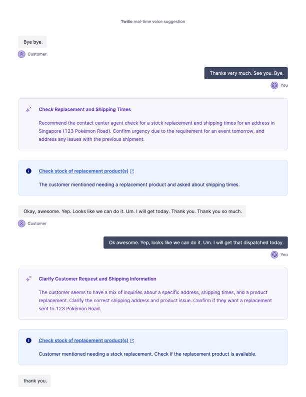

# Twilio Realtime Voice Transscription for any Contact Centre
This is a demonstration project to showcaset Twilio RTT using AI for process and knowledge guidance. You can swap in other LLMs as needed.



## Setup
To kick off RTT use the `<Transcription/>` noun, pointing to the API endpoint in this project

## Twiml
Here some example Twiml, you can use the Twiml redirect block in Studio to call this via a Twilbin or host in via an asset in Twilio serverless functions.

```xml
<?xml version="1.0" encoding="UTF-8"?>
<Response>
	<Say>Hello! Thank you for calling. Please wait while we connect you to the next available agent.</Say>
	<Start>
		<Transcription 
			transcriptionEngine="google" 
			languageCode="en-AU" 
			enableAutomaticPunctuation="true"
			statusCallbackUrl="https://<your_endpoint>.twil.io/api/transcriptions-webhook"
			name="Flex hook"/> 
	</Start>
	<Enqueue workflowSid="<task_router_workflow_sid>"/>
</Response>
```

Replace the `your_endpoint` and `task_router_workflow_sid` as required.

## How it works
1. Call is established
2. Transcription noun is used in the call
3. Twilio streams the transcript (text) to the webhook defined
4. The first call to the webhook creates a new sync stream
5. All further calls stream the text to the stream endpoint
6. The web application subscribes to the stream
7. When new messages arrive ti sends the transcription to a `perform-analysis` endpoint
8. The endpoint calls the LLM(s)
9. Results from the LLM are send back via the same Sync Stream to all listeners
10. The actions/knowledge is displayed on the UI

## Example Sync Stream Messages

### Outgoing (Typically an agent)
```json
{"actor":"outbound", "type":"transcript","transcriptionText":"Hi Welcome to ACME corp"}
```

### Incoming (Typically a customer)
```json
{"actor":"inbound", "type":"transcript","transcriptionText":"Hi my name is Jeff"}
```

### AI Suggestion
```json
{"actor":"AI","type": "suggestion","ai":{"title":"Headline statement","suggestion":"This is a longer set of text"}}
```

### AI Action
```json
{"actor":"AI","type": "action","ai":{"title":"This is an action","description":"This is the detail", "action_url":"https://www.twilio.com", "completed":false}}
```